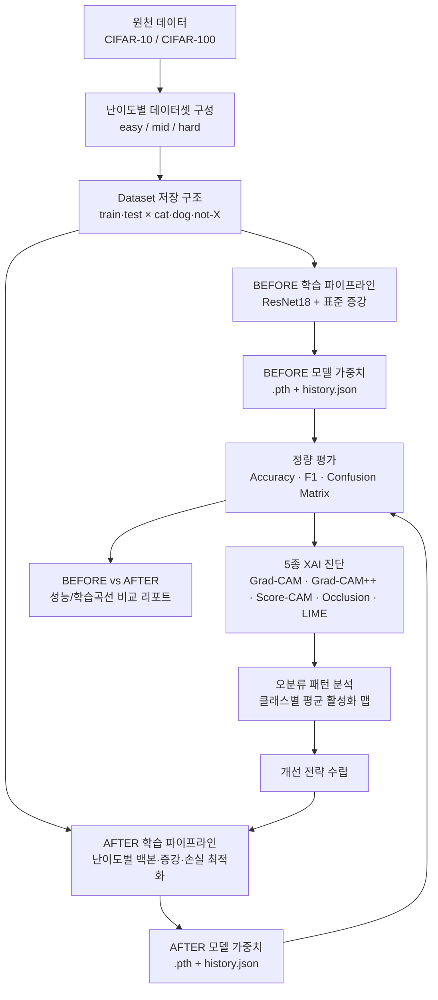
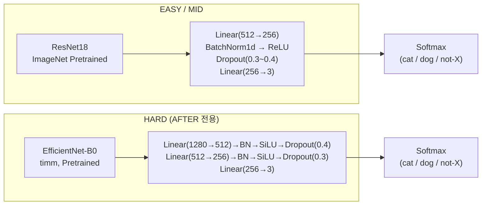
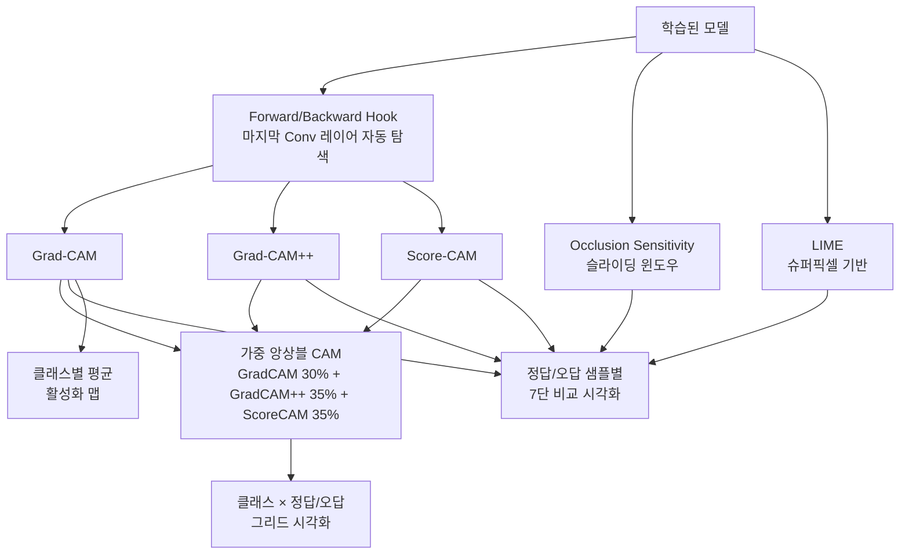

# CATvsDOGvsNOT
CAT/DOG/NOT 이미지 분류 및 난이도별 XAI 진단 프로젝트


# CAT / DOG / NOT 이미지 분류 및 난이도별 XAI 진단 프로젝트

> 전이학습(Transfer Learning) 기반 이미지 분류 모델을 구축하고, 난이도별(Easy / Mid / Hard)로 세분화된 `NOT` 클래스에 대해 5가지 XAI(설명가능 AI) 기법으로 모델의 판단 근거를 진단·개선한 프로젝트입니다.
> BEFORE(베이스라인) → AFTER(개선) 두 단계로 실험을 구성하여, **정량적 성능 개선**과 **XAI 기반 정성적 원인 분석**을 함께 제공합니다.

---

## 목차
1. [프로젝트 개요](#1-프로젝트-개요)
2. [시스템 아키텍처](#2-시스템-아키텍처)
3. [데이터 출처 및 전처리](#3-데이터-출처-및-전처리)
4. [핵심 구현 및 최적화](#4-핵심-구현-및-최적화)
5. [기술 스택](#5-기술-스택)
6. [설치 및 실행 방법](#6-설치-및-실행-방법)
7. [폴더 구조](#7-폴더-구조)
8. [주요 트러블슈팅](#8-주요-트러블슈팅)
9. [결과 해석](#9-결과-해석)
10. [최종 회고 및 성찰](#10-최종-회고-및-성찰)
11. [향후 발전 계획](#11-향후-발전-계획)

---

## 1. 프로젝트 개요

### 1-1. 배경 및 목표
딥러닝 기반 이미지 분류기는 학습 데이터의 구성(클래스 불균형, 클래스 간 시각적 유사도)에 따라 성능 편차가 크게 발생하며, **"왜 틀렸는가"** 에 대한 답은 Accuracy나 Confusion Matrix만으로는 알기 어렵습니다. 본 프로젝트는 이러한 문제의식에서 출발하여 다음 두 가지를 목표로 설계되었습니다.

1. **난이도 기반 벤치마크 설계**: `cat`, `dog` 이미지와 시각적 유사도가 다른 세 종류의 `NOT` 데이터셋(`easy` / `mid` / `hard`)을 구성하여, 동일한 모델이 배경/오브젝트 난이도에 따라 어떻게 성능이 달라지는지 체계적으로 검증
2. **XAI 기반 원인 진단 → 개선 → 재검증 루프**: Grad-CAM 계열 기법과 LIME, Occlusion Sensitivity를 종합 적용하여 오분류 원인을 시각적으로 진단하고, 이를 근거로 학습 전략을 개선한 뒤 **BEFORE / AFTER 정량 비교**로 개선 효과를 검증

### 1-2. 프로젝트 구성
본 리포지토리는 하나의 실험을 두 단계로 나누어 제공합니다.

| 단계 | 목적 | 노트북 |
|---|---|---|
| **BEFORE** | ResNet18 단일 백본 + 표준 증강/손실함수로 학습한 베이스라인 모델의 정량/정성 평가 | `img_cls_BEFORE.ipynb` |
| **AFTER** | 클래스 불균형·과적합·오분류 패턴 진단 결과를 반영해 손실함수·증강·스케줄러·백본을 개선한 모델의 재평가 | `img_cls_AFTER.ipynb` |

각 노트북은 **① 모델 학습(또는 저장된 가중치 로드) → ② 정량 평가(Accuracy/F1/Confusion Matrix) → ③ 5가지 XAI 기법 시각화 → ④ 난이도별 성능/학습곡선 비교** 순서로 동일한 파이프라인을 공유하며, AFTER 노트북은 BEFORE 대비 개선 항목이 코드 주석과 마크다운 셀에 명시되어 있습니다.

### 1-3. 한눈에 보는 최종 성과 (Test Accuracy 기준)

| 난이도 | BEFORE | AFTER | 개선폭 |
|:---:|:---:|:---:|:---:|
| EASY | 94.01% | **95.83%** | +1.82%p |
| MID  | 88.68% | **91.11%** | +2.43%p |
| HARD | 82.98% | **88.17%** | **+5.19%p** |

가장 어려운 `HARD` 난이도에서 가장 큰 폭의 성능 개선이 이루어졌으며, 이는 XAI 진단을 통해 발견한 문제(과적합, cat↔not-hard 혼동)에 표적화된 개선을 적용한 결과입니다. 자세한 내용은 [9. 결과 해석](#9-결과-해석)을 참고하세요.

---

## 2. 시스템 아키텍처

### 2-1. 전체 파이프라인



### 2-2. 모델 아키텍처 (난이도별 백본 팩토리)

`build_model(not_type)` 함수가 난이도에 따라 백본을 선택하고 분류 헤드를 재구성합니다.



- **BEFORE**: 모든 난이도에 **ResNet18** 단일 백본 사용
- **AFTER**: EASY·MID는 ResNet18을 유지하되 헤드 구조를 미세 조정, **HARD는 EfficientNet-B0(timm)로 백본을 교체**하여 더 풍부한 특징 표현력을 확보 (자세한 배경은 [8. 트러블슈팅](#8-주요-트러블슈팅) 참고)

### 2-3. XAI 진단 아키텍처



---

## 3. 데이터 출처 및 전처리

### 3-1. 데이터 출처
`torchvision.datasets`에서 제공하는 **CIFAR-10**과 **CIFAR-100**을 기반으로 자체 구성하였습니다.

- **`cat` / `dog`**: CIFAR-10의 해당 클래스 이미지 사용
- **`NOT` 후보군**: CIFAR-100은 `cat`/`dog` 클래스가 존재하지 않으므로, 전체 100개 클래스를 `NOT` 클래스 후보로 활용

### 3-2. 난이도별 NOT 클래스 설계
`cat`, `dog`와의 **시각적 유사도**를 기준으로 `NOT` 클래스를 3단계로 세분화하여, 모델이 어느 수준의 유사도부터 혼동을 일으키는지 정밀하게 진단할 수 있도록 설계했습니다.

| 난이도 | 명칭 | 특징 | 예시 클래스 |
|:---:|---|---|---|
| 낮음 | `not-easy` | cat/dog와 완전히 다른 무생물·일상 사물 | bus, car, bed, cup, clock |
| 중간 | `not-mid` | 같은 생명체 범주이나 외형이 확연히 다름 | spider, flatfish, shark, man, woman |
| 높음 | `not-hard` | 털·체형·자세 등에서 cat/dog와 공통점이 많아 혼동 유발 | bear, wolf, tiger, lion, fox |

### 3-3. 데이터셋 저장 구조

```
dataset/
├── easy/
│   ├── train/
│   │   ├── cat/
│   │   ├── dog/
│   │   └── not-easy/
│   └── test/
│       ├── cat/
│       ├── dog/
│       └── not-easy/
├── mid/
│   ├── train/{cat, dog, not-mid}/
│   └── test/{cat, dog, not-mid}/
└── hard/
    ├── train/{cat, dog, not-hard}/
    └── test/{cat, dog, not-hard}/
```

이 구조 덕분에 난이도별 데이터셋을 **독립적으로 로드**하여 실험할 수 있고, 난이도에 따른 성능 차이를 직접 비교할 수 있습니다. (참고: 초기 구성 기준 EASY 테스트셋은 `cat`/`dog` 각 1,000장, `not-easy` 5,000장 규모였으며, `cat`·`dog` 대비 `NOT` 클래스가 수 배 많은 구조적 클래스 불균형이 존재합니다. 이는 이후 손실함수 설계에 직접적인 영향을 줍니다.)

### 3-4. 전처리 및 데이터 증강

`ImageFolder` + `DataLoader` 조합으로 로드하며, `train`은 80:20 비율(`val_ratio=0.2`)로 다시 분할하여 별도의 **train/val** 세트를 구성합니다. (클래스별 층화 분할로 각 클래스 비율을 유지)

**공통 검증/테스트 전처리**
```python
TEST_TRANSFORM = transforms.Compose([
    transforms.Resize((224, 224)),
    transforms.ToTensor(),
    transforms.Normalize([0.485, 0.456, 0.406], [0.229, 0.224, 0.225])
])
```

**BEFORE 학습 증강 (전 난이도 공통)**
```python
TRAIN_TRANSFORM_BL = transforms.Compose([
    transforms.RandomResizedCrop(224, scale=(0.8, 1.0)),
    transforms.RandomHorizontalFlip(),
    transforms.ColorJitter(brightness=0.2, contrast=0.2, saturation=0.2, hue=0.05),
    transforms.ToTensor(),
    transforms.Normalize([0.485, 0.456, 0.406], [0.229, 0.224, 0.225]),
])
```

**AFTER 학습 증강 (난이도별 강도 차등 적용)**

| 난이도 | 기본 증강 | 추가 증강 |
|---|---|---|
| EASY | RandomResizedCrop(scale 0.7~1.0) + HFlip + ColorJitter | RandomGrayscale(p=0.05), RandomErasing(p=0.15) |
| MID  | 상동 | **RandAugment**(N=2, M=9), RandomErasing(p=0.25) |
| HARD | 상동 | RandomVerticalFlip(p=0.1), **RandAugment**(N=2, M=12), RandomErasing(p=0.35) |

난이도가 높아질수록 증강 강도(RandAugment magnitude, RandomErasing 확률)를 점진적으로 높여, 더 어려운 데이터셋일수록 모델이 다양한 변형에 강건해지도록 설계했습니다. 또한 AFTER에서는 **Test-Time Augmentation(TTA)** 전처리(원본 / 수평 플립 / 256→224 CenterCrop)를 추가로 정의하여 추론 시 3가지 뷰의 소프트맥스 평균으로 예측 안정성을 높였습니다.

---

## 4. 핵심 구현 및 최적화

### 4-1. 손실 함수: Label Smoothing + 클래스 가중치
`cat`/`dog` 클래스가 `NOT` 클래스 대비 수 배 적은 구조적 불균형을 해결하기 위해, 단순 `CrossEntropyLoss`(BEFORE) 대신 **Label Smoothing이 결합된 가중 손실 함수**(AFTER)를 직접 구현했습니다.

```python
class LabelSmoothingCrossEntropy(nn.Module):
    def __init__(self, smoothing=0.1, weight=None):
        super().__init__()
        self.smoothing = smoothing
        self.weight = weight

    def forward(self, pred, target):
        n_classes = pred.size(1)
        confidence = 1.0 - self.smoothing
        smooth_val = self.smoothing / (n_classes - 1)
        true_dist = torch.full_like(pred, smooth_val)
        true_dist.scatter_(1, target.unsqueeze(1), confidence)
        log_prob = F.log_softmax(pred, dim=1)
        if self.weight is not None:
            w = self.weight.to(pred.device)[target]
            loss = -(true_dist * log_prob).sum(dim=1)
            return (loss * w).mean()
        return -(true_dist * log_prob).sum(dim=1).mean()
```

클래스 가중치는 학습 세트의 클래스 분포로부터 역비율로 자동 계산됩니다 (`compute_class_weights`). 이를 통해 소수 클래스(`cat`, `dog`)의 오분류에 더 큰 페널티를 부여합니다.

### 4-2. 데이터 레벨 정규화: MixUp / CutMix
MID·HARD 난이도에서는 배치 단위로 50% 확률로 **MixUp** 또는 **CutMix**를 적용해 결정 경계를 부드럽게 만들고 과적합을 억제했습니다.

```python
def cutmix_data(x, y, alpha=1.0):
    lam = np.random.beta(alpha, alpha)
    idx = torch.randperm(x.size(0), device=x.device)
    x1, y1, x2, y2 = rand_bbox(x.size(), lam)
    mixed_x = x.clone()
    mixed_x[:, :, x1:x2, y1:y2] = x[idx, :, x1:x2, y1:y2]
    lam_adj = 1 - (x2 - x1) * (y2 - y1) / (x.size(-1) * x.size(-2))
    return mixed_x, y, y[idx], lam_adj
```

### 4-3. 최적화 전략: AdamW + Custom Cosine Warmup
- **옵티마이저**: `Adam`(BEFORE) → `AdamW`(weight_decay=1e-2, AFTER)로 전환하여 정규화 강화
- **스케줄러**: `ReduceLROnPlateau`(BEFORE) → 자체 구현한 `CosineWarmupScheduler`(Linear Warmup → Cosine Annealing, AFTER)로 전환

```python
class CosineWarmupScheduler:
    def __init__(self, optimizer, warmup_epochs, total_epochs, min_lr=1e-6):
        self.optimizer, self.warmup_epochs = optimizer, warmup_epochs
        self.total_epochs, self.min_lr = total_epochs, min_lr
        self.base_lrs = [pg['lr'] for pg in optimizer.param_groups]

    def step(self, epoch):
        if epoch < self.warmup_epochs:
            scale = (epoch + 1) / self.warmup_epochs
        else:
            progress = (epoch - self.warmup_epochs) / (self.total_epochs - self.warmup_epochs)
            scale = 0.5 * (1 + math.cos(math.pi * progress))
        for pg, base in zip(self.optimizer.param_groups, self.base_lrs):
            pg['lr'] = max(base * scale, self.min_lr)
```

- **Gradient Clipping**(`max_norm=1.0`)을 추가해 MixUp/CutMix·RandAugment로 인한 손실 스파이크 시 학습 발산을 방지했습니다.
- **EarlyStopping**: 검증 손실 기준 patience(EASY/MID=15, HARD=20)를 적용하여 최적 시점의 가중치만 저장(`best_model_*.pth`)합니다.

### 4-4. 추론 최적화: Test-Time Augmentation (TTA)
평가 시 원본 + 수평 플립 + 256→224 CenterCrop 3가지 뷰의 소프트맥스 확률을 평균하여 최종 예측을 산출, 단일 뷰 추론 대비 예측 노이즈를 줄였습니다.

### 4-5. XAI 5종 세트 직접 구현
설명가능성 확보를 위해 5가지 기법을 라이브러리에 의존하지 않고 **직접 구현**했습니다.

| 기법 | 핵심 아이디어 | 구현 포인트 |
|---|---|---|
| **Grad-CAM** | 마지막 conv층의 그래디언트 평균을 채널별 가중치로 사용 | `register_forward_hook` + `register_full_backward_hook` |
| **Grad-CAM++** | 픽셀별 2·3차 미분을 활용한 alpha 가중치로 다중 객체·세밀한 영역 포착 | `grads²`, `grads³` 기반 alpha 계산 |
| **Score-CAM** | 그래디언트 없이 활성화 채널을 마스크로 사용해 실제 예측 점수 변화로 중요도 산출 | 상위 top-k(20) 채널만 사용해 연산량 절감 |
| **Occlusion Sensitivity** | 슬라이딩 윈도우(32px, stride 16)로 이미지를 가리며 예측 확률 변화 측정 | 모델 구조에 무관한 model-agnostic 검증 수단 |
| **LIME** | 슈퍼픽셀 분할 후 로컬 선형 근사로 중요 영역 탐색 | `lime_image.LimeImageExplainer` 활용 |

또한 **Grad-CAM(30%) + Grad-CAM++(35%) + Score-CAM(35%) 가중 앙상블 CAM**을 추가로 구현하여 단일 기법의 노이즈를 상호 보완했습니다. 백본이 ResNet18/EfficientNet-B0로 달라져도 동작하도록 마지막 conv 레이어를 자동 탐색하는 헬퍼(`_get_last_conv`)를 별도로 구현했습니다.

```python
def _get_last_conv(model, not_type):
    backbone = BACKBONE_MAP.get(not_type, 'resnet18')
    if backbone == 'resnet18':
        return model.layer4[-1].conv2
    else:  # EfficientNet-B0 (timm)
        return model.conv_head
```

---

## 5. 기술 스택

| 분류 | 기술 |
|---|---|
| **언어 / 실행 환경** | Python 3, Google Colab (GPU 런타임) |
| **딥러닝 프레임워크** | PyTorch, torchvision |
| **사전학습 백본** | `timm` (ResNet18, EfficientNet-B0) |
| **XAI / 해석가능성** | Grad-CAM / Grad-CAM++ / Score-CAM (자체 구현), `lime`, `scikit-image`(슈퍼픽셀) |
| **평가·지표** | `scikit-learn` (classification_report, confusion_matrix, f1_score, accuracy_score) |
| **시각화** | `matplotlib`, `seaborn`, `opencv-python-headless` |
| **데이터 처리** | `numpy`, `Pillow(PIL)` |
| **개발/실행 관리** | Jupyter Notebook(`.ipynb`), Google Drive (모델·데이터셋 영속화) |

---

## 6. 설치 및 실행 방법

### 6-1. Google Colab에서 실행 (권장)
본 프로젝트는 Google Colab + Google Drive 마운트 기준으로 작성되었습니다.

1. `img_cls_BEFORE.ipynb` 또는 `img_cls_AFTER.ipynb`를 Colab에서 엽니다.
2. `dataset.zip`(전처리된 easy/mid/hard 데이터셋)을 `MyDrive/CATvsDOGvsNOT/`에 업로드합니다.
3. 노트북의 **CELL 2 (Google Drive 마운트 및 데이터셋 압축 해제)** 셀을 실행합니다. 최초 실행 시 압축이 자동 해제되고, 이후 실행에서는 마커 파일을 확인해 재해제를 건너뜁니다.
4. 상단부터 순서대로 셀을 실행합니다. `best_model_*.pth`가 지정된 경로에 이미 존재하면 **재학습 없이 로드**하고, 없으면 자동으로 학습을 시작합니다.

```python
# CELL 2 핵심 로직 예시
DRIVE_BASE = "/content/drive/MyDrive/CATvsDOGvsNOT/AFTER"
ZIP_PATH   = "/content/drive/MyDrive/CATvsDOGvsNOT/dataset.zip"
# ZIP_PATH를 압축 해제 후 easy/mid/hard 하위 구조를 자동 탐색합니다.
```

### 6-2. 로컬 환경에서 실행
Colab 전용 셀(`google.colab.drive`, `!pip install`, 한글 폰트 설치용 `apt-get`)만 아래와 같이 대체하면 로컬에서도 동일하게 동작합니다.

```bash
# 1) 가상환경 생성 및 활성화
python -m venv venv
source venv/bin/activate      # Windows: venv\Scripts\activate

# 2) 의존성 설치
pip install torch torchvision timm lime scikit-image \
            opencv-python-headless scikit-learn \
            matplotlib seaborn numpy pillow jupyter

# 3) 데이터셋 배치 (Drive 마운트 대신 로컬 경로 사용)
#    ./dataset/{easy,mid,hard}/{train,test}/{cat,dog,not-X}/
#    ./models/{BEFORE,AFTER}/best_model_{easy,mid,hard}.pth

# 4) 노트북 실행
jupyter notebook img_cls_AFTER.ipynb
```

> 로컬 실행 시 노트북 상단의 `DRIVE_BASE`, `ZIP_PATH`, `EXTRACT_PATH` 변수만 로컬 경로로 수정하면 나머지 학습/평가/XAI 파이프라인 코드는 수정 없이 그대로 동작합니다.

### 6-3. 저장된 모델로 바로 XAI 분석만 실행하기
이미 학습이 끝난 `.pth` 가중치가 있다면(본 리포지토리의 `BEFORE.zip` / `AFTER.zip`), 학습 셀은 자동으로 스킵되고 곧바로 아래 순서로 평가·XAI 분석이 진행됩니다.

```
CELL 15 (EASY 분석) → CELL 16 (MID 분석) → CELL 17 (HARD 분석)
→ CELL 18 (BEFORE/AFTER 성능 비교) → CELL 19 (학습 곡선)
```

---

## 7. 폴더 구조

```
CAT-DOG-NOT-Classification/
│
├── notebooks/
│   ├── img_cls_BEFORE.ipynb        # 베이스라인 학습·평가·XAI 분석
│   └── img_cls_AFTER.ipynb         # 개선 모델 학습·평가·XAI 분석
│
├── models/
│   ├── BEFORE/
│   │   ├── best_model_easy.pth
│   │   ├── best_model_easy_history.json
│   │   ├── best_model_mid.pth
│   │   ├── best_model_mid_history.json
│   │   ├── best_model_hard.pth
│   │   └── best_model_hard_history.json
│   └── AFTER/
│       ├── best_model_easy.pth
│       ├── best_model_easy_history.json
│       ├── best_model_mid.pth
│       ├── best_model_mid_history.json
│       ├── best_model_hard.pth
│       └── best_model_hard_history.json
│
├── dataset/                        # 미포함 (용량 이슈로 dataset.zip 별도 관리)
│   ├── easy/{train,test}/{cat,dog,not-easy}/
│   ├── mid/{train,test}/{cat,dog,not-mid}/
│   └── hard/{train,test}/{cat,dog,not-hard}/
│
├── docs/
│   └── 프로젝트_보고서.pdf          # 초기 버전 프로젝트 보고서 (본 README의 확장판 기준 자료)
│
└── README.md
```

> `models/BEFORE`, `models/AFTER`는 각각 첨부된 `BEFORE.zip`, `AFTER.zip`의 내용과 대응됩니다. `_history.json`에는 epoch별 train/val loss·accuracy(및 AFTER는 learning rate)가 기록되어 있어 재학습 없이 학습 곡선을 재현할 수 있습니다.

---

## 8. 주요 트러블슈팅

프로젝트를 진행하며 마주친 문제들을 AI 엔지니어 관점에서 원인 분석 → 해결 순서로 정리했습니다.

### 8-1. 클래스 불균형으로 인한 `cat` 클래스 recall 저하
- **문제 상황**: `cat`/`dog`는 각 1,000장 내외인 반면 `NOT` 클래스는 이보다 최대 5배 많아, 모델이 다수 클래스(`NOT`)로 예측을 편향하는 경향이 나타났습니다. 특히 `cat`이 `NOT` 클래스로 잘못 분류되는 비율이 세 난이도 모두에서 가장 두드러진 오류 패턴이었습니다.
- **원인 분석**: 단순 `CrossEntropyLoss`는 클래스별 표본 수 차이를 전혀 반영하지 않아, 그래디언트가 자연스럽게 다수 클래스 쪽으로 편향됩니다.
- **해결**: 학습 세트 클래스 분포로부터 역비율 가중치를 자동 계산(`compute_class_weights`)하여 `LabelSmoothingCrossEntropy`에 결합, 소수 클래스 오분류에 더 큰 페널티를 부여했습니다. 동시에 MixUp/CutMix로 결정 경계 자체를 완만하게 만들어 소수 클래스 주변 과적합도 함께 완화했습니다.

### 8-2. Grad-CAM 오버레이 이미지가 완전히 검게 나오는 시각화 버그
- **문제 상황**: Grad-CAM 히트맵을 원본 이미지 위에 오버레이했을 때, 특정 실행 환경에서 결과 이미지가 대부분 검은색으로만 렌더링되는 현상이 발생했습니다.
- **원인 분석**: `cam_to_overlay` 함수가 `uint8` 타입([0, 255])의 배열을 반환한 뒤, 후속 코드에서 `np.clip(img, 0, 1)`을 적용하는 구조였습니다. `matplotlib.imshow`는 `uint8` 배열을 [0, 255] 스케일로 해석하는데, 이미 0~1로 클리핑된 값은 대부분 0 또는 1 근처로 뭉개져 사실상 전부 검은 픽셀로 보이게 된 것입니다. 즉 **반환 타입(uint8)과 후처리 로직(0~1 클리핑)의 스케일 불일치**가 원인이었습니다.
- **해결**: `cam_to_overlay`의 반환 타입을 `float32`, [0, 1] 스케일로 통일하도록 수정했습니다. 이 수정은 클래스별 평균 활성화 맵(`visualize_mean_cam`)에도 동일하게 적용했으며, 기존에는 원본 이미지 없이 순수 히트맵만 표시되던 것을 **원본 이미지 위 오버레이 방식**으로 함께 개선하여 시각적 해석력을 높였습니다.

### 8-3. 다중 XAI 기법 동시 적용 시 Forward/Backward Hook 충돌
- **문제 상황**: Grad-CAM, Grad-CAM++, Score-CAM을 한 파이프라인에서 순차적으로 호출하자, 한 기법의 hook이 남긴 activation/gradient가 다른 기법의 계산에 영향을 주는 간섭이 발생할 위험이 있었습니다. 세 기법 모두 동일한 `layer4[-1].conv2`(또는 `conv_head`)에 hook을 등록하기 때문입니다.
- **원인 분석**: 하나의 모델 인스턴스에 여러 `register_forward_hook`/`register_full_backward_hook`을 중첩 등록하면, 각 클래스가 참조하는 `self._activations`/`self._gradients`가 마지막 호출 결과로 서로 덮어써질 수 있습니다.
- **해결**: `run_xai_pipeline` 내부에서 기법별로 **독립적인 모델 인스턴스**(`model_gc`, `model_gcpp`, `model_sc`)를 각각 `load_model`로 새로 로드하여 hook을 분리했습니다. 동일 가중치를 공유하지만 서로 다른 파이썬 객체이므로 hook 간 간섭 없이 동시 비교 시각화가 가능해졌습니다. 메모리 사용량이 늘어나는 트레이드오프가 있었지만, 분석 정확성을 우선했습니다.

### 8-4. HARD 모델의 검증 손실 불안정 → 백본 교체 시 XAI 호환성 문제
- **문제 상황**: 베이스라인(BEFORE) HARD 모델은 학습 후반부(10 epoch 이후)로 갈수록 검증 손실이 들쭉날쭉해지며 학습/검증 손실 격차가 벌어지는 **과적합 조짐**을 보였습니다. `cat`/`dog`가 `not-hard`(곰·늑대·호랑이·사자·여우 등)로 오분류되는 비율도 가장 높았습니다.
- **원인 분석**: ResNet18의 표현력이 `not-hard`처럼 실루엣·질감이 유사한 클래스 간 미세한 차이를 포착하기에 한계가 있었고, 정규화 강도(단일 Dropout, weight_decay 1e-4 수준)도 상대적으로 약해 과적합에 취약했습니다.
- **해결**: HARD 난이도에 한해 백본을 **EfficientNet-B0(timm)**로 교체하고, RandAugment·RandomErasing·MixUp·CutMix를 모두 적용해 정규화를 강화했습니다. 이 과정에서 ResNet18과 EfficientNet-B0의 **마지막 conv 레이어 경로가 다르다는 새로운 이슈**(`layer4[-1].conv2` vs `conv_head`)가 발견되어, XAI 모듈이 하드코딩된 레이어 참조 대신 `BACKBONE_MAP` 기반으로 레이어를 자동 탐색하도록 `_get_last_conv` 헬퍼를 추가 구현했습니다. 결과적으로 HARD 모델은 Test Accuracy 82.98% → 88.17%로 전 난이도 중 가장 큰 개선폭(+5.19%p)을 기록했습니다.

---

## 9. 결과 해석

### 9-1. 정량 평가 종합 비교

| 난이도 | 구분 | Backbone | Test Accuracy | F1 (Macro) | F1 (Weighted) |
|:---:|:---:|:---:|:---:|:---:|:---:|
| EASY | BEFORE | ResNet18 | 0.9401 | 0.8921 | 0.9400 |
| EASY | AFTER  | ResNet18 | **0.9583** | **0.9217** | **0.9579** |
| MID  | BEFORE | ResNet18 | 0.8868 | 0.8570 | 0.8857 |
| MID  | AFTER  | ResNet18 | **0.9111** | **0.8916** | **0.9113** |
| HARD | BEFORE | ResNet18 | 0.8298 | 0.8124 | 0.8289 |
| HARD | AFTER  | EfficientNet-B0 | **0.8817** | **0.8705** | **0.8819** |

### 9-2. 학습 안정성 비교 (Best Validation Accuracy 기준)

| 난이도 | BEFORE 총 학습 epoch | BEFORE Best epoch | BEFORE Best Val Acc | AFTER 총 학습 epoch | AFTER Best epoch | AFTER Best Val Acc |
|:---:|:---:|:---:|:---:|:---:|:---:|:---:|
| EASY | 24 | 24 | 95.23% | 85 | 83 | 95.61% |
| MID  | 22 | 21 | 90.60% | 63 | 48 | 90.45% |
| HARD | 22 | 20 | 84.93% | 100 | 94 | **87.93%** |

AFTER의 EarlyStopping patience(15~20)가 BEFORE(10)보다 넉넉하게 설정되어 있어, 특히 HARD 모델은 94 epoch까지 안정적으로 학습을 이어가며 성능을 끌어올릴 수 있었습니다. 반면 MID의 경우 AFTER가 더 많은 epoch을 학습했음에도 Best Val Acc가 BEFORE보다 근소하게 낮게 나타났는데, 이는 RandAugment + MixUp의 강한 정규화가 **검증 손실 최소화 시점**과 **테스트 정확도 최대화 시점**을 다소 어긋나게 만든 결과로 해석됩니다. 실제 Test Accuracy는 AFTER가 BEFORE보다 2.43%p 높아, 검증 세트 기준 최적 시점 선택이 테스트 일반화 성능과 반드시 일치하지는 않음을 보여주는 사례입니다.

### 9-3. 정성 평가 — XAI가 밝혀낸 오분류 패턴
5가지 XAI 기법을 종합한 결과, 공통적으로 다음과 같은 인사이트를 확인했습니다.

1. **`cat` 클래스의 취약성**: 모든 난이도, BEFORE/AFTER 모두에서 `cat`이 가장 낮은 F1-score를 기록했습니다. Grad-CAM 시각화 결과 모델이 고양이 이미지를 판단할 때 이미지 전체 실루엣이 아니라 **일부 국소 영역(귀, 눈 주변 등)에만 집중**하는 경향이 반복적으로 관찰되었고, 이것이 배경이 복잡하거나 유사 동물(`not-hard`)이 등장했을 때 오분류로 이어졌습니다.
2. **난이도가 높을수록 활성화 영역이 분산**: EASY에서는 Grad-CAM 활성화가 객체 중심에 뚜렷하게 모이는 반면, HARD로 갈수록 활성화 영역이 배경까지 퍼지는 양상이 나타나 클래스 간 시각적 유사도가 실제로 모델의 주의(attention) 패턴에도 영향을 준다는 것을 확인했습니다.
3. **앙상블 CAM의 효과**: 단일 Grad-CAM만으로는 노이즈가 있는 경우에도, Grad-CAM++·Score-CAM과의 가중 평균 앙상블에서는 더 안정적이고 객체 중심에 정합된 활성화 맵을 얻을 수 있었습니다.
4. **Score-CAM·Occlusion·LIME의 상호 검증 가치**: 그래디언트 기반 기법(Grad-CAM류)이 보여주는 활성화 영역이 실제로 예측에 인과적으로 기여하는지 Occlusion Sensitivity·Score-CAM으로 교차 검증할 수 있었고, LIME은 슈퍼픽셀 단위로 더 해석하기 쉬운 근거를 제공해 비전공자 대상 설명에도 유용했습니다.

### 9-4. 종합 해석
BEFORE에서 발견된 문제(클래스 불균형, HARD 과적합, cat 오분류 집중)에 **정확히 표적화된 개선**(가중 손실, MixUp/CutMix, 백본 교체, 스케줄러 개선)을 적용한 결과, 세 난이도 모두에서 Accuracy와 F1-score가 유의미하게 상승했습니다. 특히 개선 여지가 가장 컸던 HARD 난이도에서 가장 큰 개선폭을 보였다는 점은, **XAI 기반 오류 진단 → 표적 개선**이라는 본 프로젝트의 방법론이 실제로 유효했음을 보여줍니다.

---

## 10. 최종 회고 및 성찰

- **"정량 지표만으로는 모델을 신뢰할 수 없다"**: Accuracy가 90%를 넘는 모델도 Grad-CAM으로 들여다보면 이미지의 핵심이 아닌 부수적인 패턴에 의존해 우연히 맞춘 경우가 섞여 있었습니다. XAI를 학습 파이프라인에 처음부터 포함시킨 것이 개선 방향을 정확히 잡는 데 가장 크게 기여했습니다.
- **난이도 설계의 중요성**: `NOT` 클래스를 단일 카테고리로 두지 않고 easy/mid/hard로 세분화한 설계 덕분에, "모델이 정확히 어느 수준의 시각적 유사도부터 무너지는가"를 정량적으로 짚어낼 수 있었습니다. 이는 데이터셋 설계 단계의 의사결정이 이후 모든 분석의 해상도를 좌우한다는 것을 체감한 지점이었습니다.
- **한 가지 정답은 없다는 것**: 보고서에서 언급되었듯 MID 모델은 파인튜닝을 적용하지 않은 버전이 더 우수한 성능을 보였습니다. 모든 난이도에 동일한 레시피(백본, 파인튜닝 여부, 정규화 강도)를 일괄 적용하는 대신, 난이도별로 다른 전략을 실험하고 검증하는 접근이 실제로 더 나은 결과를 만들었습니다. "모범 답안"을 그대로 적용하기보다 **데이터의 특성에 맞춰 실험적으로 검증하는 태도**가 중요하다는 것을 다시 확인했습니다.
- **검증 지표와 테스트 지표의 괴리**: MID AFTER 모델 사례처럼, 검증 손실 기준 최적 체크포인트가 테스트 정확도 기준 최적과 항상 일치하지는 않았습니다. 다양한 기준(Loss, Accuracy, F1)을 함께 모니터링하고 최종 산출물 선택 시 다각도로 검토해야 한다는 교훈을 얻었습니다.
- **엔지니어링 디테일이 분석 신뢰도를 좌우한다**: Grad-CAM 오버레이가 새까맣게 나오던 dtype 버그처럼, 사소해 보이는 시각화 버그가 자칫 "모델이 아무것도 학습하지 못했다"는 잘못된 결론으로 이어질 뻔했습니다. XAI 시각화 코드 자체도 모델 코드만큼 꼼꼼한 검증이 필요하다는 점을 배웠습니다.

---

## 11. 향후 발전 계획

1. **Hard Negative Mining 자동화**: 현재는 CIFAR-100 클래스를 수작업으로 easy/mid/hard에 배정했습니다. 임베딩 유사도(CLIP 등) 기반으로 cat/dog와의 시각적 거리를 자동 산출해 난이도를 동적으로 재구성하는 파이프라인을 구축할 계획입니다.
2. **정량적 XAI 평가 지표 도입**: 현재는 XAI 결과를 정성적으로 해석하고 있습니다. Deletion/Insertion AUC, Pointing Game 등 정량적 XAI 신뢰도 지표를 도입해 "어떤 기법이 실제로 더 신뢰할 만한가"를 수치로 검증하고자 합니다.
3. **오픈셋 인식(Open-Set Recognition) 확장**: 현재의 `NOT` 클래스는 사전에 정의된 사물로 구성되어 있습니다. 학습 시 전혀 본 적 없는 임의 이미지에 대해서도 "cat/dog가 아님"을 판단할 수 있는 오픈셋/OOD(Out-of-Distribution) 탐지 기법(Energy-based OOD, Mahalanobis distance 등)을 결합할 예정입니다.
4. **경량화 및 배포**: EfficientNet-B0 기반 HARD 모델을 지식 증류(Knowledge Distillation) 또는 ONNX/TensorRT 변환을 통해 경량화하여, 모바일/엣지 환경에서도 동작하는 데모 애플리케이션(웹 데모 or Streamlit)으로 배포할 계획입니다.
5. **난이도별 앙상블 모델**: 현재는 난이도별로 독립된 모델을 운용합니다. 세 모델의 예측을 결합하는 게이팅(gating) 또는 앙상블 메커니즘을 도입해 단일 통합 모델의 성능을 실험해볼 예정입니다.
6. **실험 관리 체계화**: 현재 `.pth` + `history.json` 수동 관리 방식을 MLflow/W&B, DVC 등으로 전환하여 데이터 버전·하이퍼파라미터·실험 결과를 체계적으로 추적하고, CI 기반 자동 재현성 검증 파이프라인을 구축할 계획입니다.
7. **XAI 기반 능동 학습(Active Learning) 루프**: XAI가 "모델이 엉뚱한 곳을 보고 맞춘" 샘플을 자동으로 플래깅하여, 해당 샘플을 우선적으로 재검토·추가 학습에 반영하는 휴먼-인-더-루프 파이프라인으로 발전시킬 예정입니다.

---

*본 README는 `img_cls_BEFORE.ipynb`, `img_cls_AFTER.ipynb`의 실제 코드와 실행 히스토리(`*_history.json`), 그리고 초기 프로젝트 보고서(`프로젝트_보고서.pdf`)를 기반으로 작성되었습니다.*
